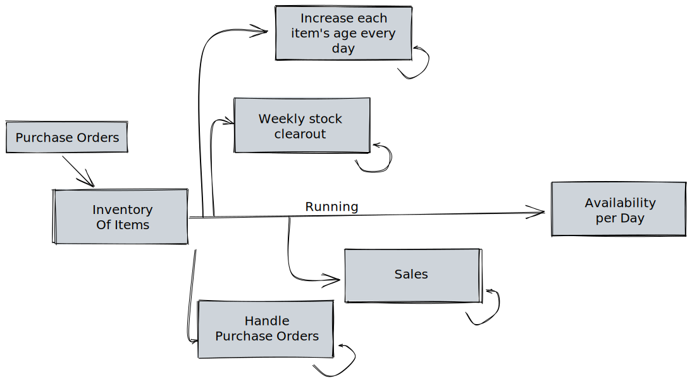
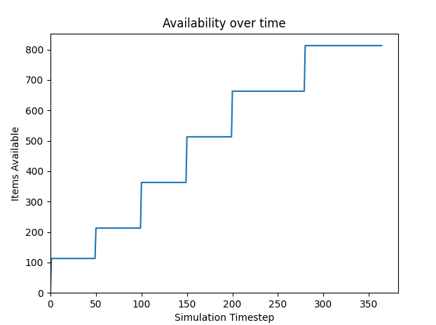
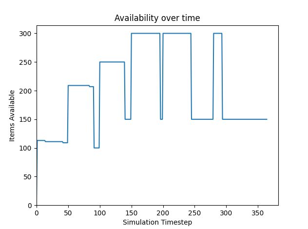
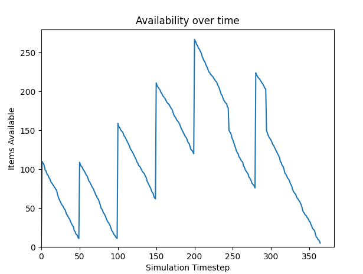
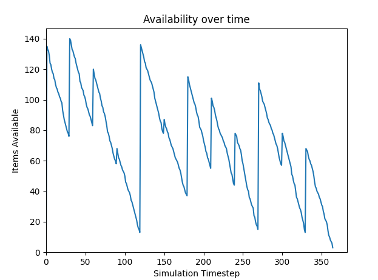
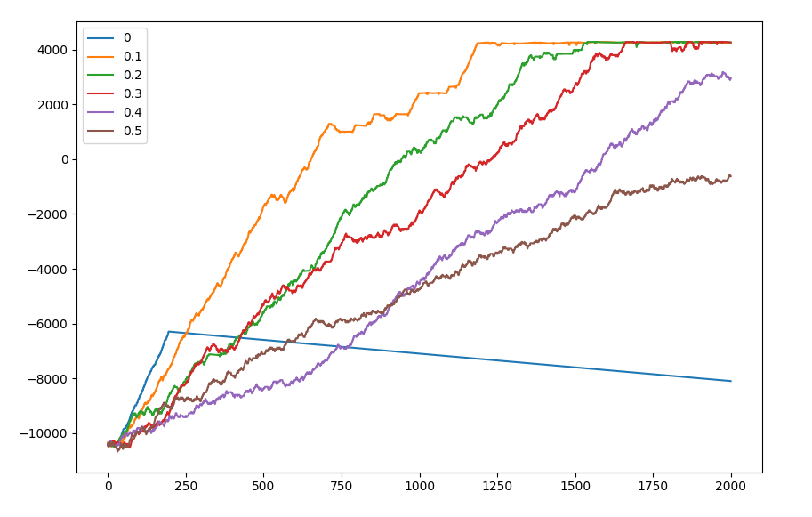

# Inventory-Optimisation-Demo
#### Demo and slides for a talk about inventory modelling and strategy optimisation in Python.


Using [simpy](https://simpy.readthedocs.io/en/latest/) for discrete event simulation, [matplotlib](https://matplotlib.org/stable/api/_as_gen/matplotlib.pyplot.html) for graphs, the [epsilon-greedy algorithm](https://en.wikipedia.org/wiki/Multi-armed_bandit#:~:text=Epsilon%2Dgreedy,-strategy) for input optimisation, and the [reveal-js](https://revealjs.com/) framework for the presentation.

__Slides viewable [here](https://lukestorry.github.io/Inventory-Optimisation/slides.html)__

---
## Overview

---
## Output
#### With only the Purchasing event

#### After adding aged stock clearout

#### After adding sales

#### Result of greedy-epsilon optimisation

#### Comparison of different Epsilon values (reward per iteration)


---
## Setup & running
Install required packages: `pip install -r .\requirements.txt`

Run the scripts with: `python simulation.py` or `python optimisation.py`

---
## Creating your own optimiser
Either use the simple greedy-epsilon-agent-based optimiser as a starting point, or in a new file:
```python
from simulation import PurchaseOrder, Simulation

# Initial inputs
purchase_orders = [PurchaseOrder(0, 20), PurchaseOrder(100, 100)]

for iteration in range(100):
    simulation = Simulation(purchase_orders)
    simulation.run()
    simulation.plot()

    # Customise this calculation depending on requirements
    cost = sum(simulation.availabilities)
    
    # Calculate a new set of more-optimal inputs
    purchase_orders = [] 
```